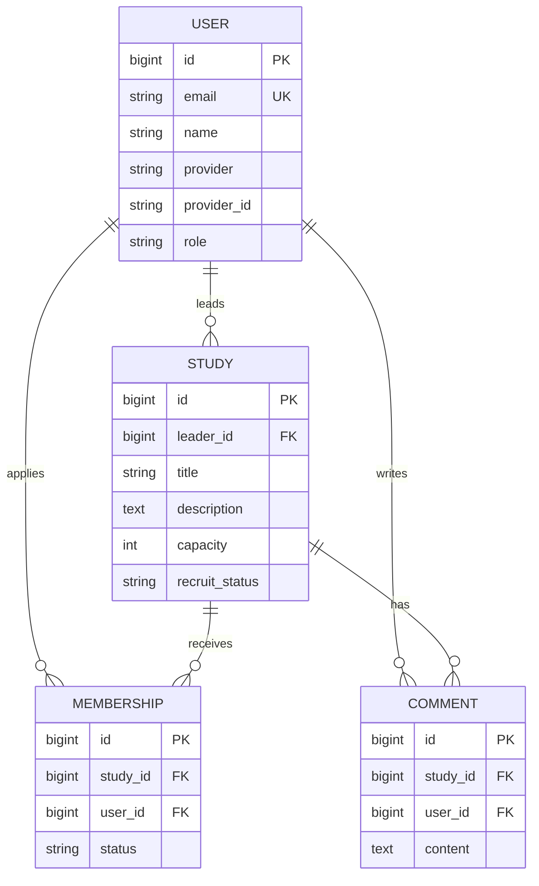
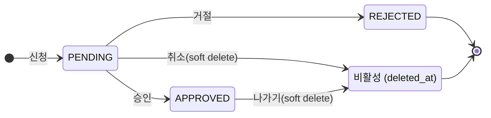
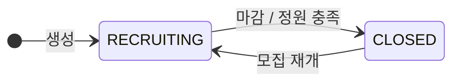

# 스터디 모임 모집 플랫폼 — 기획서

> 사용자가 스터디 모임을 만들고, 다른 사람이 참가 신청을 하면 모임장이 승인/거절하는 서비스.
> **스택**: Spring Boot 3.x · Java 21 · Spring Data JPA · MySQL · Spring Security(OAuth2 + JWT) · springdoc-openapi · Docker

---

## 관련 문서

- **용어 사전** (`스터디모임_용어사전.md`) — 표준 어휘, 표기 규칙, 축약어
- **테이블 정의서** (`스터디모임_테이블정의서.md`) — DB 컬럼 수준 상세 명세
- **개발 컨벤션** (`스터디모임_개발컨벤션.md`) — 패키지 구조, 코드 스타일, Git 규약
- **API 문서** — 구현 후 Swagger UI 링크로 대체

---

## 1. 기능 범위 (MVP 자르기)

가장 먼저, 그리고 가장 중요한 단계. "지금 만들 것 / 나중에 / 안 함"으로 나눠서 범위를 고정한다.
범위를 자르지 않으면 끝나지 않는다.

### ✅ 1차 (MVP) — 지금 만든다

- [ ] 소셜 로그인 (구글)
- [ ] 모임 생성 / 수정 / 삭제
- [ ] 모임 목록 조회 (기본 페이징)
- [ ] 모임 상세 조회
- [ ] 참가 신청
- [ ] 모임장의 신청 승인 / 거절
- [ ] 참여 중인 모임에서 나가기(탈퇴)
- [ ] 모임 댓글 작성 / 삭제
- [ ] 내가 만든 모임 / 내가 참여한 모임 조회
- [ ] 모집 상태 관리 (모집중 / 마감), 정원 관리
- [ ] 로그인 이력 기록 + 내 로그인 이력 조회 (보안 실습)

### 🔜 2차 — 나중에 (여유 되면)

- [ ] 소셜 로그인 provider 추가 (카카오, 네이버)
- [ ] 검색 / 필터 (지역, 카테고리, 키워드)
- [ ] 알림 (신청 들어옴 / 승인됨)
- [ ] 모임 카테고리 · 태그
- [ ] 멤버 강퇴
- [ ] 정렬 / 페이징 고도화
- [ ] 모임 대표 이미지 업로드

### ❌ 안 함 — 이번 실습 범위 밖

- 실시간 채팅
- 결제
- 추천 알고리즘
- 별도 모바일 앱

> **자르는 기준**: 1차는 "로그인 → 모임 만들고 → 신청·승인 → 댓글"이라는 하나의 완결된 흐름이 돌아가는 데 필요한 것만. 이 흐름 하나로 인증·인가·상태관리·관계매핑 실습이 전부 들어간다.

---

## 2. 기능 명세 (유저 스토리)

각 기능을 "누가 / 무엇을 / 왜"로 한 줄씩 정리. 이 목록이 곧 API 목록(6번)과 권한 표(5번)의 근거가 된다.
액터는 **비회원 / 회원 / 모임장** 세 종류.

### 인증

| ID | 누가 | 무엇을 | 왜 |
|----|------|--------|-----|
| US-01 | 사용자 | 구글 계정으로 로그인한다 | 별도 회원가입 없이 빠르게 시작하려고 |
| US-02 | 회원 | 로그아웃한다 | 공용 PC 등에서 세션을 안전하게 종료하려고 |

### 모임 탐색 (비회원 포함)

| ID | 누가 | 무엇을 | 왜 |
|----|------|--------|-----|
| US-03 | 비회원 | 모임 목록을 조회한다 | 가입 전에 어떤 모임이 있는지 둘러보려고 |
| US-04 | 비회원 | 모임 상세를 조회한다 | 참여 전에 모임 내용·정원·상태를 확인하려고 |

### 모임 운영 (회원)

| ID | 누가 | 무엇을 | 왜 |
|----|------|--------|-----|
| US-05 | 회원 | 새 모임을 생성한다 | 직접 스터디를 모집하려고 |
| US-06 | 회원 | 모집 중인 모임에 참가 신청한다 | 관심 있는 스터디에 들어가려고 |
| US-07 | 회원 | 자신의 참가 신청을 취소한다 | 마음이 바뀌었을 때 신청을 무를 수 있도록 |
| US-17 | 회원 | 참여 중인 모임에서 나간다 | 더 이상 활동하지 않을 때 빠지려고 |
| US-08 | 회원 | 모임에 댓글을 작성한다 | 모임에 대해 질문하거나 소통하려고 |
| US-09 | 회원 | 자신이 쓴 댓글을 삭제한다 | 잘못 쓴 글을 정리하려고 |

### 내 활동 조회 (회원)

| ID | 누가 | 무엇을 | 왜 |
|----|------|--------|-----|
| US-10 | 회원 | 내가 만든 모임 목록을 조회한다 | 내가 운영 중인 모임을 모아 보려고 |
| US-11 | 회원 | 내가 참여한 모임 목록을 조회한다 | 내 신청·참여 현황을 모아 보려고 |
| US-16 | 회원 | 내 로그인 이력을 조회한다 | 내 계정에 비정상 접속이 없는지 확인하려고 |

### 모임 관리 (모임장)

| ID | 누가 | 무엇을 | 왜 |
|----|------|--------|-----|
| US-12 | 모임장 | 자신의 모임 정보를 수정한다 | 모집 내용·정원을 최신 상태로 유지하려고 |
| US-13 | 모임장 | 자신의 모임을 삭제한다 | 더 이상 운영하지 않는 모임을 정리하려고 |
| US-14 | 모임장 | 들어온 참가 신청을 승인/거절한다 | 모임에 맞는 인원을 직접 선별하려고 |
| US-15 | 모임장 | 모임을 마감한다 | 정원이 찼거나 모집을 중단하려고 |

> **핵심 인가 규칙(미리 메모)**: US-12·13·14·15는 "그 모임의 모임장 본인"만 가능, US-07·09는 "작성자 본인"만 가능. → 5번 권한 표에서 확정.
> **2차로 미룬 것**: 강퇴(멤버 내보내기), 알림은 1차 스토리에서 제외.

## 3. 도메인 모델 / ERD

엔티티 4개: **User, Study, Membership, Comment**.

### 관계 요약

- `User (1) —< Study (N)` : 한 사용자가 여러 모임의 **모임장**이 될 수 있다 (`Study.leader_id`)
- `User (N) —< Membership >— (N) Study` : 참가 신청/참여 관계. 중간 엔티티 `Membership`으로 분해
- `User (1) —< Comment (N)` , `Study (1) —< Comment (N)` : 댓글 작성자 / 댓글이 달린 모임

### 핵심 설계 결정

- **모임장은 `Study.leader_id` FK로 직접 표현.** "이 모임의 주인인가?" 체크가 한 줄로 끝나 인가 로직이 단순해진다. → `Membership`에는 role 컬럼을 두지 않고, 모임장은 Membership에 포함하지 않는다.
- **`Membership`은 신청자/참여자만** 담는다. `status`로 신청 상태를 관리.
- `Membership (study_id, user_id)`에 **유니크 제약** → 같은 모임 중복 신청 방지.
- 소셜 로그인 사용자는 `provider` + `provider_id` 조합으로 식별.

### 엔티티 상세

컬럼 수준 상세 명세(타입·길이·제약조건·인덱스·삭제 정책)는 **테이블 정의서**(`스터디모임_테이블정의서.md`)로 분리. 이 섹션은 관계·설계 결정·ERD 등 개념 모델만 다룬다.

### ERD (mermaid)



### 네이밍 · 감사 · 로그 결정

- **PK는 `id`, FK는 `{테이블}_id`** (`leader_id`, `study_id`, `user_id`). JPA 표준 관례. PK를 `user_id`로 바꾸지 않는다.
- **시각 컬럼은 JPA Auditing으로 자동화.** `BaseTimeEntity` 공통 부모 + `@CreatedDate` / `@LastModifiedDate` 로 `created_at` / `updated_at` 자동 기록. 엔티티마다 수동으로 넣지 않는다.
- **`created_by` / `updated_by`는 두지 않는다.** 소유자 FK(`leader_id`, `user_id`)가 이미 "누가 만들었는가"를 표현하므로 중복. 필요해지면 `@CreatedBy`로 나중에 추가.
- **에러 / 애플리케이션 로그는 DB 테이블로 만들지 않는다.** Logback/SLF4J → stdout → Docker 컨테이너 로그로 수집.
- **API 정의 테이블 불필요.** Swagger(springdoc)가 코드에서 자동 생성.
- **로그인 이력(`login_history`)은 2차 옵션.** 보안 감사/기능으로 원하면 그때 추가.

## 4. 상태값 정의

상태값은 enum으로 관리하며 영대문자 SNAKE_CASE로 표기한다. 각 상태의 전이 규칙과 상태 간 상호작용(비즈니스 규칙)을 확정한다.

### 4.1 신청 상태 (`membership.status`)

값: `PENDING`(대기) / `APPROVED`(승인) / `REJECTED`(거절). 초기값은 신청 시 `PENDING`.

| 전이 | 트리거 | 비고 |
|------|--------|------|
| (생성) → PENDING | 회원이 참가 신청 (US-06) | 모집중인 모임만 가능 |
| PENDING → APPROVED | 모임장 승인 (US-14) | 정원 여유 있을 때만 |
| PENDING → REJECTED | 모임장 거절 (US-14) | 종료 상태 (행 보존) |
| PENDING → 비활성 | 신청자 취소 (US-07) | soft delete: `deleted_at` 기록 |
| APPROVED → 비활성 | 회원 나가기 (US-17) | soft delete: `deleted_at` 기록 |

- `REJECTED`는 종료 상태이며 **행을 보존**한다(모임장의 거절 기록). 승인 멤버 강퇴는 2차.
- **취소·나가기는 물리 삭제하지 않고 soft delete** (`deleted_at`에 시각 기록)로 처리한다. 데이터·이력 보존, 실수 복구, 통계 정확도를 위해.
- **활성 멤버 = `status = APPROVED` AND `deleted_at IS NULL`**. 정원 카운트는 활성 멤버 수.
- **재신청 규칙(활성 유일성)**: `(study_id, user_id)`에 대해 `deleted_at IS NULL`인 행은 최대 1건. 취소·나가기로 `deleted_at`이 찍힌 행은 슬롯을 비우므로 **재신청 가능**. `REJECTED`(deleted_at NULL)는 남아 있어 **재신청 차단**(의도된 동작).
- MySQL은 조건부(partial) 유니크 인덱스를 지원하지 않으므로 활성 유일성은 **서비스 계층에서 검증**한다. 구현은 Hibernate 6 `@SoftDelete` 또는 `deleted_at` + `@SQLDelete`/`@Where`.

### 4.2 모집 상태 (`study.recruit_status`)

값: `RECRUITING`(모집중) / `CLOSED`(마감). 초기값은 모임 생성 시 `RECRUITING`.

| 전이 | 트리거 | 비고 |
|------|--------|------|
| (생성) → RECRUITING | 모임 생성 (US-05) | |
| RECRUITING → CLOSED | 모임장 수동 마감 (US-15) **또는** 정원 충족 | 정원 충족 시 자동 |
| CLOSED → RECRUITING | 모임장 모집 재개 | 정원 여유 있을 때 의미 있음 |

### 4.3 비즈니스 규칙 (상태 간 상호작용)

정원 카운트 정의: **`APPROVED` 상태인 `membership` 수** (모임장 제외).

| 규칙 | 내용 |
|------|------|
| R1 정원 자동 마감 | 승인으로 APPROVED 수 == `capacity` 가 되면 `study.recruit_status`를 `CLOSED`로 자동 전환 |
| R2 정원 초과 승인 차단 | APPROVED 수 == `capacity` 이면 추가 승인 불가 |
| R3 신청 차단 | `study.recruit_status`가 `CLOSED`이면 신규 신청(PENDING 생성) 불가 |
| R4 모집 재개 | 모임장이 `CLOSED → RECRUITING` 재개는 활성 멤버 < `capacity` 일 때만 허용 |
| R5 나감 → 슬롯 복구 | 멤버가 나가면(soft delete) 활성 멤버 수가 줄어 정원에 여유 발생 → 모임장이 모집 재개 가능 (자동 재개 아님) |

### 상태 전이도 (mermaid)





## 5. 권한 정책 표

인가(authorization)는 두 계층으로 나뉜다. 이 분리가 보안 설계의 핵심.

- **1계층 — 인증·역할**: 로그인 여부 / 역할. Spring Security가 URL·메서드 단위로 처리. 미인증 → `401`.
- **2계층 — 소유권**: "본인 것 / 자기 모임"인지 서비스 계층에서 리소스 소유자 확인. 위반 → `403`.
- **원칙**: 남의 모임 · 남의 댓글 · 남의 신청은 건드릴 수 없다.

### 5.1 역할 정의

- **비회원 (Guest)**: 로그인하지 않은 방문자. 조회만.
- **회원 (Member)**: 로그인한 사용자. 기본 권한.
- **모임장 (Leader)**: 특정 모임의 **소유자**. 고정 역할이 아니라 리소스 소유 관계 — 한 사용자가 자기 모임에선 모임장, 남의 모임에선 회원이다.
- **관리자 (Admin)**: 전체 관리 권한. MVP 제외 (2차).

### 5.2 권한 매트릭스

`O` 허용 · `X` 불가 · `본인` 본인 소유 리소스만 허용

| 기능 (US) | 비회원 | 회원 | 모임장 | 상태·소유 조건 |
|-----------|:---:|:---:|:---:|----------------|
| 모임 목록·상세 조회 (US-03,04) | O | O | O | 누구나 |
| 구글 로그인 (US-01) | O | — | — | 비로그인 상태에서 시작 |
| 로그아웃 (US-02) | X | O | O | 로그인 필요 |
| 모임 생성 (US-05) | X | O | O | 로그인 필요. 생성자가 그 모임의 모임장이 됨 |
| 참가 신청 (US-06) | X | O | X | 모집중(RECRUITING) + 활성 신청 없음. 자기 모임엔 신청 불가 |
| 신청 취소 (US-07) | X | 본인 | — | 본인의 PENDING 신청만 (soft delete) |
| 모임 나가기 (US-17) | X | 본인 | — | 본인의 APPROVED 멤버십만 (soft delete) |
| 댓글 작성 (US-08) | X | O | O | 로그인 필요 |
| 댓글 삭제 (US-09) | X | 본인 | 본인 | 본인이 쓴 댓글만 (모더레이션은 2차) |
| 내 모임·참여·로그인이력 조회 (US-10,11,16) | X | 본인 | 본인 | 본인 데이터만 |
| 모임 수정 (US-12) | X | X | O | 그 모임의 모임장만 |
| 모임 삭제 (US-13) | X | X | O | 그 모임의 모임장만 (soft delete) |
| 신청 승인·거절 (US-14) | X | X | O | 그 모임의 모임장만. 승인은 정원 여유 시 |
| 모임 마감·재개 (US-15) | X | X | O | 그 모임의 모임장만 |

### 5.3 구현 메모

- "모임장만" 권한은 전역 역할 체크가 아니라 **행 단위 소유권 체크**(`study.leader_id == 현재 사용자 id`)로 구현한다.
- "본인 것만" 권한도 동일 (`comment.user_id == 현재 사용자 id`, `membership.user_id == 현재 사용자 id`).
- 미인증 접근은 `401 Unauthorized`, 인증됐으나 소유권 없는 접근은 `403 Forbidden`으로 구분 (상세는 7번 공통 규약).

## 6. API 명세

구현 후에는 Swagger(springdoc) UI가 실제 명세를 자동 생성한다. 이 섹션은 **구현 전 엔드포인트 설계**로, 컨트롤러 구조의 청사진이다.

### 6.1 설계 규칙

- Base path: `/api`
- 컬렉션은 **복수형 명사** (`/studies`, `/comments`, `/memberships`)
- 소속·소유 관계는 **중첩 경로** (`/studies/{studyId}/memberships`)
- 현재 사용자 리소스는 `/api/me/...` 로 모음
- 명사로 안 떨어지는 상태 변경은 하위 리소스 PATCH (`/studies/{id}/recruit-status`)
- 조회 `GET` · 생성 `POST` · 부분 수정 `PATCH` · 삭제 `DELETE`(soft)
- 보호 엔드포인트는 `Authorization: Bearer {accessToken}` 헤더 필요
- 목록 조회는 `page`, `size`, `sort` 쿼리 파라미터 (Spring `Pageable`)

### 6.2 인증 (Spring Security 제공)

| 메서드 | 경로 | 설명 | 권한 | US |
|--------|------|------|------|-----|
| GET | `/oauth2/authorization/google` | 구글 로그인 시작 (프레임워크 제공) | 비회원 | US-01 |
| GET | `/login/oauth2/code/google` | 콜백 → JWT 발급 (프레임워크 제공) | — | US-01 |
| POST | `/api/auth/refresh` | 액세스 토큰 재발급 | refresh 토큰 | — |
| POST | `/api/auth/logout` | 로그아웃 (refresh 토큰 무효화) | 회원 | US-02 |

### 6.3 모임 (studies)

| 메서드 | 경로 | 설명 | 권한 | US |
|--------|------|------|------|-----|
| POST | `/api/studies` | 모임 생성 | 회원 | US-05 |
| GET | `/api/studies` | 목록 (페이징, `recruit_status` 필터) | 누구나 | US-03 |
| GET | `/api/studies/{studyId}` | 상세 | 누구나 | US-04 |
| PATCH | `/api/studies/{studyId}` | 정보 수정 | 모임장 | US-12 |
| DELETE | `/api/studies/{studyId}` | 삭제 (soft) | 모임장 | US-13 |
| PATCH | `/api/studies/{studyId}/recruit-status` | 모집 마감/재개 | 모임장 | US-15 |

### 6.4 참가 신청 (memberships)

| 메서드 | 경로 | 설명 | 권한 | US |
|--------|------|------|------|-----|
| POST | `/api/studies/{studyId}/memberships` | 참가 신청 (→ PENDING 생성) | 회원 | US-06 |
| GET | `/api/studies/{studyId}/memberships` | 신청자 목록 | 모임장 | US-14 |
| PATCH | `/api/studies/{studyId}/memberships/{membershipId}` | 승인/거절 (`status` 변경) | 모임장 | US-14 |
| DELETE | `/api/studies/{studyId}/memberships/{membershipId}` | 취소/나가기 (soft) | 본인 | US-07, US-17 |

> 취소(PENDING)와 나가기(APPROVED)는 같은 `DELETE`로 통합. 서비스가 현재 상태를 보고 처리.

### 6.5 댓글 (comments)

| 메서드 | 경로 | 설명 | 권한 | US |
|--------|------|------|------|-----|
| POST | `/api/studies/{studyId}/comments` | 작성 | 회원 | US-08 |
| GET | `/api/studies/{studyId}/comments` | 목록 (페이징) | 누구나 | US-04 부속 |
| DELETE | `/api/studies/{studyId}/comments/{commentId}` | 삭제 (soft) | 본인 | US-09 |

### 6.6 내 활동 (me)

| 메서드 | 경로 | 설명 | 권한 | US |
|--------|------|------|------|-----|
| GET | `/api/me` | 내 프로필 | 회원 | — |
| GET | `/api/me/studies` | 내가 만든 모임 | 회원 | US-10 |
| GET | `/api/me/memberships` | 내 신청/참여 내역 | 회원 | US-11 |
| GET | `/api/me/login-history` | 내 로그인 이력 | 회원 | US-16 |

### 6.7 주요 요청/응답 예시

응답 공통 포맷·에러 코드는 7번 공통 규약에서 확정. 여기서는 핵심 바디 형태만.

**모임 생성** — `POST /api/studies`
```json
// 요청
{ "title": "스프링 스터디", "description": "주 1회 온라인", "capacity": 6 }
// 응답 201
{ "id": 12, "title": "스프링 스터디", "capacity": 6, "recruitStatus": "RECRUITING", "leaderId": 3 }
```

**승인/거절** — `PATCH /api/studies/12/memberships/45`
```json
// 요청
{ "status": "APPROVED" }   // 또는 "REJECTED"
```

**참가 신청** — `POST /api/studies/12/memberships`
```json
// 요청 바디 없음 (인증 토큰의 사용자가 신청자)
// 응답 201
{ "id": 45, "studyId": 12, "userId": 7, "status": "PENDING" }
```

## 7. 공통 규약 (API 동작)

API가 일관되게 응답하기 위한 규약. 코드 스타일·패키지·git 규약은 별도 `개발 컨벤션` 문서 참조.

### 7.1 응답 포맷

성공 응답은 DTO를 그대로 반환하고 HTTP 상태코드로 의미를 전달한다. 불필요한 래핑을 줄인다.

- `200 OK` 조회/수정, `201 Created` 생성, `204 No Content` 삭제(soft, 바디 없음)
- 목록은 페이지 객체로 감싼다.

```json
// 단건
{ "id": 12, "title": "스프링 스터디", "recruitStatus": "RECRUITING" }
// 목록
{ "content": [ ... ], "page": { "number": 0, "size": 20, "totalElements": 53, "totalPages": 3 } }
```

> 대안: 모든 응답을 `{ data, error }` 봉투로 감싸는 방식도 있다. 프론트가 항상 같은 형태를 파싱하는 장점이 있으나, 여기서는 HTTP 상태코드를 살리는 무봉투 방식을 택한다.

### 7.2 에러 처리

`@RestControllerAdvice` 전역 핸들러 + `ErrorCode` enum으로 일원화. 에러 바디는 다음 형태로 통일.

```json
{
  "code": "STUDY_FULL",
  "message": "정원이 가득 차 승인할 수 없습니다.",
  "status": 409,
  "path": "/api/studies/12/memberships/45",
  "timestamp": "2026-06-17T10:00:00"
}
```

| HTTP | 상황 | 에러 코드 예 |
|------|------|------|
| 400 Bad Request | 입력 검증 실패 (Bean Validation) | `VALIDATION_FAILED` |
| 401 Unauthorized | 미인증 (토큰 없음·만료) | `UNAUTHORIZED`, `TOKEN_EXPIRED` |
| 403 Forbidden | 소유권 위반 | `NOT_STUDY_LEADER`, `NOT_COMMENT_AUTHOR` |
| 404 Not Found | 리소스 없음 | `STUDY_NOT_FOUND`, `MEMBERSHIP_NOT_FOUND` |
| 409 Conflict | 상태/규칙 충돌 | `DUPLICATE_MEMBERSHIP`, `STUDY_FULL`, `STUDY_CLOSED`, `CANNOT_APPLY_OWN_STUDY` |
| 500 Internal | 서버 오류 | `INTERNAL_ERROR` |

> 4번 상태 규칙(R1~R5) 위반은 대부분 `409 Conflict`로 매핑된다. 표준 `ProblemDetail`(RFC 7807, Spring 6 내장)로 대체 가능.

### 7.3 페이징

- 쿼리 파라미터: `page`(0-base), `size`(기본 20, 최대 100), `sort=field,asc|desc`
- 기본 정렬: `createdAt,desc`
- 응답에 `page` 메타(number, size, totalElements, totalPages) 포함 (7.1 목록 형태)

## 8. 환경 / 설정 항목

비밀이거나 환경마다 달라지는 값은 코드·깃에 하드코딩하지 않고 **환경변수로 주입**한다(12-factor). `application.yml`엔 비밀 아닌 기본 설정만, 비밀은 `${ENV_VAR}`로 참조한다.

### 8.1 환경변수 목록

| 변수명 | 용도 | 예시/비고 | 비밀 |
|--------|------|-----------|:---:|
| `SPRING_PROFILES_ACTIVE` | 활성 프로파일 | `local` / `prod` | |
| `DB_HOST` | DB 호스트 | `localhost`(로컬), 컨테이너명(compose) | |
| `DB_PORT` | DB 포트 | `3306` | |
| `DB_NAME` | DB 스키마명 | `studydb` | |
| `DB_USERNAME` | DB 계정 | `study` | |
| `DB_PASSWORD` | DB 비밀번호 | — | 🔒 |
| `GOOGLE_CLIENT_ID` | 구글 OAuth 클라이언트 ID | Google Cloud Console 발급 | |
| `GOOGLE_CLIENT_SECRET` | 구글 OAuth 시크릿 | — | 🔒 |
| `GOOGLE_REDIRECT_URI` | OAuth 콜백 주소 | `http://localhost:8080/login/oauth2/code/google` | |
| `JWT_SECRET` | JWT 서명 키 | 256-bit↑ (`openssl rand -base64 32`) | 🔒 |
| `JWT_ACCESS_EXPIRATION` | 액세스 토큰 만료(ms) | `3600000` (1시간) | |
| `JWT_REFRESH_EXPIRATION` | 리프레시 토큰 만료(ms) | `1209600000` (14일) | |
| `CORS_ALLOWED_ORIGINS` | 허용 프론트 출처 | `http://localhost:5173` 등 | |
| `FRONTEND_REDIRECT_URI` | 로그인 성공 후 토큰 전달 리다이렉트 대상 | `http://localhost:5173/oauth/callback` | |
| `COOKIE_SECURE` | refresh 쿠키 Secure 플래그 | 로컬 `false` / 운영 `true` | |

### 8.2 application.yml 매핑 예시

```yaml
spring:
  datasource:
    url: jdbc:mysql://${DB_HOST:localhost}:${DB_PORT:3306}/${DB_NAME:studydb}
    username: ${DB_USERNAME:study}
    password: ${DB_PASSWORD}
  jpa:
    hibernate.ddl-auto: validate   # 운영은 validate, 로컬 초기엔 update
  security:
    oauth2:
      client:
        registration:
          google:
            client-id: ${GOOGLE_CLIENT_ID}
            client-secret: ${GOOGLE_CLIENT_SECRET}
            scope: profile, email
jwt:
  secret: ${JWT_SECRET}
  access-expiration: ${JWT_ACCESS_EXPIRATION:3600000}
  refresh-expiration: ${JWT_REFRESH_EXPIRATION:1209600000}
app:
  frontend:
    redirect-uri: ${FRONTEND_REDIRECT_URI:http://localhost:5173/oauth/callback}
  cookie:
    secure: ${COOKIE_SECURE:false}   # refresh 쿠키 Secure (운영 true)
```

### 8.3 환경별 주입 방식

- **로컬**: `docker-compose`가 MySQL을 띄우고, `.env` 파일(또는 `application-local.yml`, 둘 다 gitignore)로 값 주입.
- **운영(배포)**: 클라우드 VM 환경변수 또는 PaaS(시크릿) 설정. 시크릿 매니저 사용 권장.

### 8.4 절대 커밋 금지

`DB_PASSWORD`, `GOOGLE_CLIENT_SECRET`, `JWT_SECRET` 및 이를 담은 `.env` / `application-secret(local).yml`은 절대 커밋하지 않는다. (`.gitignore` 등록 — 개발 컨벤션 3.4 참조)

### 8.5 비밀 발급 메모

- **JWT_SECRET**: HS256은 최소 256-bit. `openssl rand -base64 32`로 생성.
- **Google OAuth**: Google Cloud Console에서 OAuth 동의 화면 구성 → 사용자 인증 정보(OAuth 클라이언트 ID) 생성 → 승인된 리디렉션 URI에 `GOOGLE_REDIRECT_URI` 등록.
